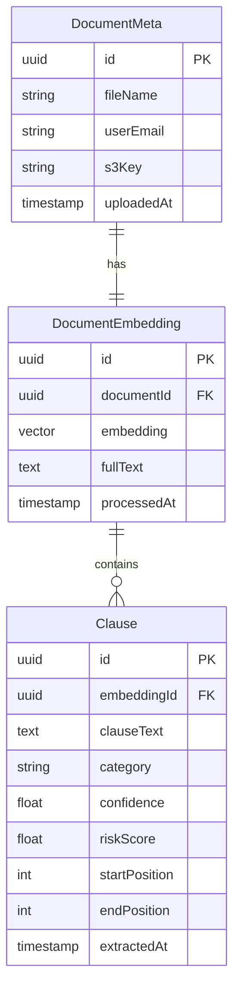

# 🧠 Legal Document Analyzer

<div align="center">


**A powerful full-stack backend system for intelligent legal document analysis**

*Automatically extract, classify, and risk-score legal clauses with state-of-the-art AI*

</div>

---

## 📄 Overview

Legal contracts often hide **risky clauses** that can expose businesses to unwanted liabilities. The Legal Document Analyzer leverages cutting-edge NLP and machine learning to automatically identify, classify, and assess these critical contract elements.

### 🎯 Key Features

- **🔍 Intelligent Clause Extraction**: Advanced semantic parsing to identify meaningful legal clauses
- **🏷️ Automated Classification**: CUAD taxonomy-based tagging (Termination, Indemnity, Confidentiality, etc.)
- **⚠️ Risk Assessment**: AI-powered scoring to flag potentially problematic clauses
- **🔎 Semantic Search**: Vector embeddings enable intelligent document retrieval

---

## ⚙️ Architecture & Tech Stack

<div align="center">

| **Component** | **Technology** | **Purpose** |
|:-------------:|:--------------:|:------------|
| 🎯 **Backend API** | Java (Spring Boot) | RESTful API, business logic, orchestration |
| 🧠 **AI/ML Service** | Python (FastAPI) + HuggingFace | Document processing, embeddings, classification |
| 🗄️ **Database** | PostgreSQL + pgvector | Structured data + vector search capabilities |
| ⚡ **Caching** | Redis | High-performance context & session storage |
| 📁 **File Storage** | S3-Compatible (Cloudflare R2) | Secure document storage and retrieval |
| 🤖 **ML Models** | LegalBERT, CUAD classifiers | Domain-specific legal language understanding |
| 📋 **Documents** | PDF (with OCR) | Support for digital and scanned legal documents |

</div>

---

## 🏗️ Project Structure

```
legal-doc-analyzer/
│
├── 📂 api-gateway/           # 🍃 Spring Boot Service for gateway control
│   ├── src/main/java/
│   │   ├── config/           # Gateway cofiguration
│   │   ├── filters/          # Authentication filters
│   │   ├── util/             # Utility classes
│   ├── src/main/resources/
│   │   └── application.yml    # Configuration
│   └── pom.xml                # Maven dependencies
|
├── 📂 auth-service/           # 🍃 Spring Boot Service for Authentication
│   ├── src/main/java/
│   │   ├── controllers/       # REST API endpoints
│   │   ├── services/          # Business logic layer
│   │   ├── entities/          # JPA database entities
│   │   └── repositories/      # Data access layer
│   │   ├── config/            # Application cofiguration
│   │   ├── filters/           # Authentication filters
│   │   ├── util/              # Utility classes
│   ├── src/main/resources/
│   │   └── application.yml    # Configuration
│   └── pom.xml                # Maven dependencies
|
├── 📂 legal-service/           # 🍃 Spring Boot Service
│   ├── src/main/java/
│   │   ├── controllers/       # REST API endpoints
│   │   ├── services/          # Business logic layer
│   │   ├── entities/          # JPA database entities
│   │   ├── util/              # Utility classes
│   │   └── repositories/      # Data access layer
│   ├── src/main/resources/
│   │   ├── db/migrations      # Database migration with flyway
│   │   └── application.yml    # Configuration
│   └── pom.xml                # Maven dependencies
│
├── 📂 python-backend/         # 🐍 FastAPI AI Service
│   ├── app/
│   │   ├── main.py           # FastAPI application
│   │   ├── models/           # ML model interfaces
│   │   ├── services/         # NLP processing logic
│   │   ├── kafka_consumer    # Kafka consumer logic
│   │   ├── kafka_producer    # Kafka producer logic
│   │   └── utils/            # Helper utilities
│   ├── requirements.txt      # Python dependencies
│   └── Dockerfile            # Container configuration
│
├── .gitignore
├── docker-compose.yml        # 🐳 Multi-service orchestration
└── README.md                 # 📖 This file
```

---

## 🚀 Quick Start Guide

### 🧩 Prerequisites

Before you begin, ensure you have:

- ☕ **Java 17+** - For Spring Boot backend
- 🐍 **Python 3.10+** - For AI/ML services
- 🐘 **PostgreSQL** with `pgvector` extension
- 🔴 **Redis** - For caching and session management
- 🐳 **Docker** (optional) - For containerized deployment
- 🤗 **HuggingFace account** - For model access

### 1️⃣ Database Setup

This is optional if you are using Database migration libraries like Flyway, you can use Flyway migrations to do the same with migration scripts.
```bash
# Install PostgreSQL with pgvector extension
# Ubuntu/Debian
sudo apt-get install postgresql postgresql-contrib
sudo apt-get install postgresql-14-pgvector

# Create database
createdb legaldb
psql legaldb -c "CREATE EXTENSION vector;"
```

### 2️⃣ Java Backend Configuration

```bash
cd java-backend

# Install dependencies
./mvnw clean install

# Configure application.yml
cp src/main/resources/application-template.yml src/main/resources/application.yml
# Edit with your database credentials

# Run the application
./mvnw spring-boot:run
```

**Sample Configuration (`application.yml`):**
```yaml
spring:
  application:
    name: legal-document-analyzer
  
  datasource:
    url: jdbc:postgresql://localhost:5432/legaldb
    username: ${DB_USERNAME:legaluser}
    password: ${DB_PASSWORD:yourpassword}
    driver-class-name: org.postgresql.Driver
  
  jpa:
    hibernate:
      ddl-auto: validate
    properties:
      hibernate:
        dialect: org.hibernate.dialect.PostgreSQLDialect
    show-sql: false
  
  redis:
    host: localhost
    port: 6379
    timeout: 2000ms

server:
  port: 8080

# Custom application properties
legal-analyzer:
  storage:
    s3:
      bucket: legal-documents
      region: us-east-1
  ai-service:
    url: http://localhost:8000
```

### 3️⃣ Python AI Service Setup

```bash
cd python-backend

# Create virtual environment
python3 -m venv .venv
source .venv/bin/activate  # On Windows: .venv\Scripts\activate

# Install dependencies
pip install -r requirements.txt

# Download required models (first run)
python -c "
from transformers import AutoTokenizer, AutoModelForSequenceClassification
AutoTokenizer.from_pretrained('ml6team/legal-longformer-base-cuad')
AutoModelForSequenceClassification.from_pretrained('ml6team/legal-longformer-base-cuad')
"

# Start the FastAPI server
uvicorn app.main:app --host 0.0.0.0 --port 8000 --reload
```

### 4️⃣ Docker Deployment (Optional)

```bash
# Start all services with Docker Compose
docker-compose up -d

# View logs
docker-compose logs -f

# Stop services
docker-compose down
```

---

## 🧪 Testing the Complete Pipeline

### Step-by-Step Workflow

1. **📤 Document Upload**
   ```bash
   curl -X POST "http://localhost:8080/legal/upload" \
        -H "Content-Type: multipart/form-data" \
        -F "file=@sample-contract.pdf" \
   ```

2. **🔄 Automatic Processing**
   - Java backend saves metadata and uploads file to S3
   - Document is sent to Python AI service for analysis via Kafka
   - AI service extracts clauses, classifies them, and assigns risk scores and sends the data back to java service via kafka

3. **💾 Data Persistence**
   - Processed clauses stored in PostgreSQL
   - Vector embeddings indexed for semantic search
   - Relationships maintained between documents and clauses

4. **🔍 Query & Retrieve**
   ```bash
   # Search for similar clauses
   curl -X POST "http://localhost:8080/legal/search?query=termination conditions" \
        -H "Content-Type: application/json" \
   ```

---

## 🧠 AI Model Output Structure

### Clause Analysis Response

```json
{
  "documentId": "doc_12345",
  "embeddings": [-0.112343, 0.123312, -0.123212, -0.123455...],
  "clauses": [
    {
      "id": "clause_001",
      "text": "Either party may terminate this Agreement with thirty (30) days written notice...",
      "category": "Termination",
      "confidence": 0.94,
      "riskScore": 0.3,
      "startPosition": 1024,
      "endPosition": 1158,
    },
    {
      "id": "clause_002",
      "text": "Company shall indemnify and hold harmless Client from any and all claims...",
      "category": "Indemnification",
      "confidence": 0.97,
      "riskScore": 0.8,
      "startPosition": 2048,
      "endPosition": 2256,
    }
  ],
}
```

---

## 🗃️ Database Schema

### Entity Relationships



### Key Tables

- **`document_meta`**: File metadata, user information, storage references
- **`document_embeddings`**: Vector representations for semantic search
- **`clauses`**: Individual clause analysis results with risk assessment

---

## 🔧 API Endpoints

### Document Management

| Method | Endpoint | Description |
|--------|----------|-------------|
| `POST` | `/legal/upload` | Upload and process new document |
| `GET` | `/legal/{id}` | Retrieve document metadata |
| `GET` | `/legal/{email}` | List user's documents |
| `DELETE` | `/legal/{id}` | Remove document and analysis |

### Clause Analysis

| Method | Endpoint | Description |
|--------|----------|-------------|
| `GET` | `/legal/clauses/document/{id}` | Get all clauses for a document |
| `GET` | `/legal/clauses/risky` | Retrieve high-risk clauses |
| `POST` | `/legal/clauses/search` | Semantic clause search |


---

## 🧠 Future Roadmap

### Phase 1: Core Enhancements
- [ ] **🔐 Multi-tenant user management** - Social logins
- [ ] **🔐 Improve Classification Accuracy** - Improve the accuracy of classification and introduce sub categories
- [ ] **✏️ Clause Editor** - Manual clause reclassification and annotation
- [ ] **📊 Analytics Dashboard** - Visual insights and trend analysis
- [ ] **🔔 Risk Alerts** - Automated notifications for high-risk patterns

### Phase 2: Advanced Features
- [ ] **💬 Conversational AI** - Natural language querying of document corpus
- [ ] **📋 Template Library** - Pre-approved clause alternatives
- [ ] **🔄 Workflow Integration** - Connect with legal review processes
- [ ] **📈 Benchmarking** - Industry-standard risk comparisons

### Phase 3: Enterprise Features
- [ ] **📝 Audit Trail** - Complete change history and compliance logging
- [ ] **🔌 API Integrations** - Connect with popular legal tech platforms
- [ ] **🌐 Multi-language Support** - International contract analysis

---

## 📚 Resources & Acknowledgements

### Research & Datasets
- **[CUAD Dataset](https://www.atticusprojectai.org/cuad)** - Contract Understanding Atticus Dataset
- **[Legal-BERT](https://huggingface.co/nlpaueb/legal-bert-base-uncased)** - Legal domain language model
- **[ml6team/legal-longformer-base-cuad](https://huggingface.co/ml6team/legal-longformer-base-cuad)** - CUAD-trained classification model

### Technologies
- **[Spring Boot](https://spring.io/projects/spring-boot)** - Java application framework
- **[FastAPI](https://fastapi.tiangolo.com/)** - Python web framework for APIs
- **[HuggingFace Transformers](https://huggingface.co/transformers/)** - State-of-the-art NLP models
- **[pgvector](https://github.com/pgvector/pgvector)** - Vector similarity search for PostgreSQL

---

<div align="center">

**Built with ❤️ by the Legal Tech Community**

</div>